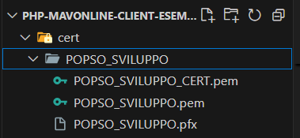

# Esempio di client per accedere a IUVOnline BPS

# Configurazione

## Prerequisiti

Per poter aprire i file zip sono necessarie delle password, che vi saranno fornite da personale Banca incaricato

## File OpenAPI

E' presente nella directory openAPI uno zip cifrato con le specifiche OpenAPI

## Installazione certificati

Decomprimere i certificati (POPSO_SVILUPPO) nella directory cert.

Il risultato sarà il seguente:



## Environment

Rinominare ed eventualmente modificare opportunamente il file .env.example in .env

## XML della chiamata

Create un file xml valido per la chiamata nella directory xml. Il file deve contenere l'XML generato secondo le specifiche inviate dalla Banca

## Composer

Eseguire `composer install` per installare le dipendenze

# Parametri di Header

Ci sono alcuni parametri che devono essere impostati nell'header

- X-Bps-Tt-IdOperazione-CodiceApplicazioneChiamante: usare il CN del certificato troncato a 8 caratteri
- X-Bps-Tt-IdOperazione-CodiceOperazione: codice_univoco di massimo 20 caratteri
- X-Bps-Tt-IdConversazione: come sopra
- X-Bps-Tc-CodiceApplicazione: codice_univoco di massimo 20 caratteri
- X-Bps-Tc-CodiceCanale: valore fisso a ITN
- X-Bps-Tc-CodiceIstituto: valore fisso a 05696

# Chiamata Effettiva

Ora è possibile eseguire il file chiamata.php dentro la directory src

```bash
php chiamata.php
```

## Certificati CA produzione

I certificati **pubblici** della CA e Intermediate CA sono presenti nella directory public_CA

I certificati di autenticazione per la produzione vi verranno consegnati da personale della Banca.
